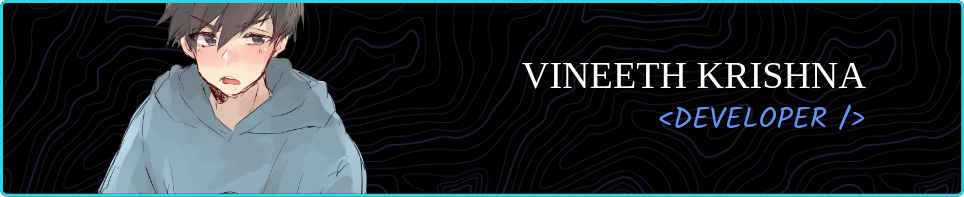

I speak to computer using :  

 
  
The grammar  I use:  
          

  
Devops:  

          
  
Database:  

  
Misc:  
          

          

  
 

 
Stats:
-----------------------------------------------
 
 

---

## 👑Trophies:

## 

